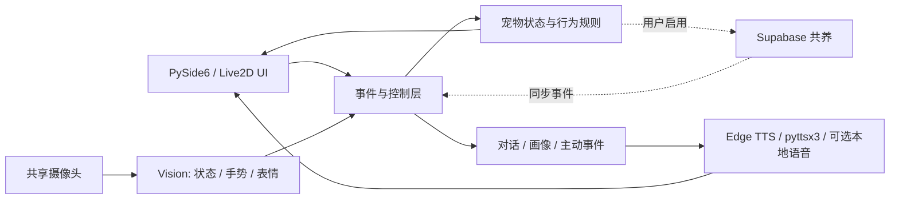

<div align="center">

# AI Homework Desktop Pet

**一个把 Live2D、视觉感知、对话、语音、状态系统和云端共养组合到桌面的智能宠物原型**

[](https://www.python.org/)
[](https://doc.qt.io/qtforpython-6/)
[](#测试)

山东大学《人工智能引论》课程设计 · Windows 优先 · 本地能力优先 · 外部服务可选

</div>

> [!NOTE]
> 这是课程项目和研究原型，不是已发布的桌面产品。摄像头、云端、Qwen-VL、DeepFace、GPT-SoVITS 和 OpenVoice 均为可选能力；缺少密钥、模型或设备时，应用会尽量降级，但不同 Python/驱动环境的完整兼容性尚未验证。

## 项目概览

AI Homework Desktop Pet 是一个运行在桌面的虚拟陪伴应用。桌宠以透明置顶窗口显示，支持 Live2D 模型渲染、鼠标交互、聊天气泡、语音播报、用户状态检测、手势控制、宠物状态管理和 Supabase 云端共养接口。

核心目标不是单一聊天窗口，而是把多个 AI 能力集成到桌宠行为中：

- UI 层负责桌宠窗口、Live2D 渲染、菜单、控制台、设置面板和云端面板。
- Vision 层负责摄像头采集、用户状态检测、手势识别、表情/光照/屏幕使用分析。
- TTS/NLP 层负责 DeepSeek 对话、Prompt 构建、聊天记忆、情绪分析和语音合成。
- State 层负责宠物心情、能量、亲密度、用户画像、行为决策和状态持久化。
- Cloud 层负责 Supabase 房间、状态同步、互动事件和联机共养的接口封装。

## 角色与动作预览

<div align="center">
  
  
  
</div>

仓库包含静态/GIF 角色与 Live2D 资源。上图展示的是内置动作素材；实际运行时，桌宠显示在透明置顶窗口中，并通过菜单、对话和状态事件切换行为。

## 运行层级

| 模式 | 启动方式 | 需要的资源 | 适用场景 |
| --- | --- | --- | --- |
| 轻量演示 | `.\run_demo.bat` | PySide6、PyOpenGL、Live2D 运行时和内置素材 | 课堂演示；默认关闭摄像头和重型视觉模块 |
| 本地交互 | `python -m app.main` | 上述依赖，可选摄像头/麦克风 | 桌宠、聊天、本地状态、规则和离线 TTS |
| 视觉增强 | 在 `.env` 开启 camera/gesture/DeepFace/Qwen-VL | 摄像头、MediaPipe/DeepFace，Qwen-VL 需要密钥 | 手势、用户状态、表情和视觉调试 |
| 云端共养 | 配置 Supabase 并执行表结构 | Supabase 项目、URL、anon key | 房间状态与互动事件同步 |

轻量演示脚本只设置当前进程的环境变量，不会覆盖 `.env`。需要长期保存配置时，可从 `.env.demo.example` 选择变量合并到自己的 `.env`。

## 主要功能

### 桌面宠物与 UI

- 透明、无边框、置顶桌宠窗口。
- 支持鼠标拖拽、左键互动、右键菜单、弧形动作菜单。
- 支持 Live2D 模型加载、动作播放、表情切换和运行时模型切换。
- 内置角色库、Live2D 库、设置面板、聊天气泡、输入框、状态栏和控制台。
- 支持桌宠自动漫游、跟随鼠标、靠边休息、悬浮淡出等桌面行为。

### 视觉感知

- 使用 OpenCV 共享摄像头流，避免多个视觉模块重复占用摄像头。
- 使用 MediaPipe 进行手势、人脸和关键点相关检测。
- 支持挥手、比心、OK、举手等手势响应。
- 支持 pinch 捏合手势缩放桌宠。
- 支持用户状态检测：正常、专注、分心、疲劳、离开、返回、学习过久、低光照等。
- 支持视觉调试面板，便于查看摄像头画面和检测结果。
- 支持前台窗口活动分类和屏幕使用时长追踪。

### 对话、语音与情绪

- DeepSeek API 对话封装，未配置或调用失败时可降级为本地回复。
- Prompt 会结合用户状态、电脑活动、宠物状态等上下文生成。
- 支持聊天记忆、用户画像和聊天情绪分析。
- 支持 Edge TTS、pyttsx3 离线回退、GPT-SoVITS、OpenVoice 后处理和本地语音包。
- 支持按宠物、情绪、动作选择语音风格或语音片段。

### 状态与 VPet 系统

- 宠物状态包含心情、能量、亲密度、饥饿、等级、经验、金币等字段。
- 行为规则会根据用户状态和宠物状态自动选择动作。
- 聊天、投喂、陪玩、打工等行为会影响宠物状态。
- 移植了部分 VPet 风格系统：物品、食物、商店、工作、主题、存档和文本规则。

### 云端共养

- 使用 Supabase 作为云端同步后端。
- `SharedPetRoomManager` 封装房间加入、状态上传、状态拉取、互动事件上传和最近事件读取。
- `CloudSyncScheduler` 提供定时同步线程。
- UI 层通过云端面板操作房间，不直接访问 Supabase。
- 详细云端表结构见 [docs/SUPABASE_SCHEMA.sql](docs/SUPABASE_SCHEMA.sql)。

## 技术栈

- Python 3.10+，项目当前代码也包含 Python 3.13 兼容处理。
- PySide6 / Qt：桌面窗口与控件。
- live2d-py / OpenGL：Live2D 模型渲染。
- OpenCV / MediaPipe / DeepFace：摄像头、手势、人脸与表情相关能力。
- DeepSeek API / Qwen-VL / DashScope：文本与多模态能力接口。
- Edge TTS / pyttsx3 / GPT-SoVITS / OpenVoice：语音合成与语音风格处理。
- Supabase：云端共养数据同步。
- pytest：单元测试。

## 架构



`app/main.py` 负责组合模块；`models/` 保存视觉、对话、语音、状态和云端领域逻辑；UI 通过接口和事件连接这些模块，避免直接操作 Supabase 或模型服务。

## 目录结构

```text
AI_homework_desktop_pet/
├── app/
│   ├── main.py                       # 应用入口，串联 UI、Vision、TTS/NLP、State、Cloud
│   ├── live2d_scanner.py             # Live2D 模型扫描
│   ├── model_switcher.py             # Live2D 运行时模型切换
│   ├── live2d_action_presets.py      # Live2D 动作预设
│   ├── controller/                   # 鼠标、键盘、动作触发等控制逻辑
│   ├── services/                     # 事件总线、同步调度、Mock 数据、应用上下文
│   └── ui/                           # 桌宠窗口、控件、云端面板、视觉调试面板
├── models/
│   ├── cloud/                        # Supabase 服务、云端模型、共享房间管理
│   ├── nlp/                          # DeepSeek、Prompt、记忆、情绪分析、主动事件
│   ├── state/                        # 宠物状态、行为规则、用户画像、接口层
│   ├── tts/                          # TTS 管理、语音包、GPT-SoVITS、OpenVoice
│   ├── vision/                       # 摄像头、用户状态、手势、表情、屏幕活动
│   └── vpet/                         # 物品、商店、工作、主题、存档、文本规则
├── assets/
│   ├── models/                       # Live2D 模型资源
│   ├── images/                       # 静态桌宠图像
│   ├── animations/                   # GIF 和帧动画资源
│   ├── live2d_modeling/              # Live2D 建模参考、姿势、外观目录
│   ├── action_mapping.json           # 动作映射
│   ├── synonyms.json                 # 同义动作映射
│   └── pet_memory.json               # 本地宠物记忆
├── docs/
│   ├── API_CONTRACTS.md              # 云端共养 API 合约
│   ├── CLOUD_SYNC_RULES.md           # 云同步规则
│   └── SUPABASE_SCHEMA.sql           # Supabase 表结构
├── scripts/                          # 配置检查、真实连接测试、数据采集脚本
├── tests/                            # 单元测试
├── tools/                            # Live2D 资源生成、压缩、目录构建工具
├── utils/                            # 配置、日志、JSON、文件与事件工具
├── requirements.txt                  # Python 依赖
├── run_demo.bat                      # Windows 轻量演示启动脚本
└── README.md
```

## 快速开始

### 1. 克隆仓库

```bash
git clone https://github.com/SWT-0407/AI_homework_desktop_pet.git
cd AI_homework_desktop_pet
```

### 2. 创建虚拟环境

Windows PowerShell:

```powershell
python -m venv .venv
.\.venv\Scripts\Activate.ps1
python -m pip install --upgrade pip
```

macOS / Linux:

```bash
python -m venv .venv
source .venv/bin/activate
python -m pip install --upgrade pip
```

### 3. 安装依赖

```bash
pip install -r requirements.txt
pip install PySide6 PyOpenGL live2d-py
```

说明：

- `requirements.txt` 覆盖视觉、语音、云同步、测试等多数依赖。
- 桌宠 UI 入口直接依赖 `PySide6`、`PyOpenGL` 和 `live2d-py`，如环境中未预装，需要额外安装。
- Windows 上使用透明置顶窗口和部分系统能力时，建议安装 `pywin32`，该依赖已在 `requirements.txt` 中按 Windows 平台声明。
- `PyAudio` 在部分 Windows 环境可能需要使用预编译 wheel 或 Conda 安装。

### 4. 配置环境变量

复制示例配置：

```bash
cp .env.example .env
```

Windows PowerShell:

```powershell
Copy-Item .env.example .env
```

常用配置：

```env
DEEPSEEK_API_KEY=
QWEN_VL_API_KEY=
SUPABASE_URL=
SUPABASE_ANON_KEY=

DESKTOP_PET_USER_STATE_ENABLED=true
DESKTOP_PET_CAMERA_ENABLED=false
DESKTOP_PET_GESTURE_ENABLED=false
DESKTOP_PET_QWEN_VL_ENABLED=false
DESKTOP_PET_DEEPFACE_ENABLED=false
DESKTOP_PET_FACE_MIMIC_ENABLED=false
DESKTOP_PET_CLOUD_ENABLED=true
DESKTOP_PET_CLOUD_ROOM_CODE=
```

`.env` 包含本地密钥和运行配置，不要提交到 Git。

### 5. 启动应用

完整入口：

```bash
python -m app.main
```

Windows 轻量演示模式：

```powershell
.\run_demo.bat
```

轻量演示模式会关闭摄像头、手势、DeepFace、Qwen-VL 等重能力，适合课堂展示或没有摄像头权限的环境。

> [!TIP]
> 首次运行建议从轻量演示开始。确认窗口和 Live2D 正常后，再逐项启用摄像头、手势、模型 API 和云同步；这样更容易定位驱动、权限或依赖问题。

## 常用运行配置

| 变量 | 默认值 | 说明 |
| --- | --- | --- |
| `DESKTOP_PET_CAMERA_ENABLED` | `false` | 启动时是否打开摄像头 |
| `DESKTOP_PET_USER_STATE_ENABLED` | `true` | 是否启用用户状态检测 |
| `DESKTOP_PET_MOCK_USER_STATE` | `false` | 是否使用模拟用户状态 |
| `DESKTOP_PET_GESTURE_FEATURE_ENABLED` | `true` | 是否启用手势功能总开关 |
| `DESKTOP_PET_GESTURE_ENABLED` | `false` | 启动时是否开始手势检测 |
| `DESKTOP_PET_QWEN_VL_ENABLED` | `false` | 是否启用 Qwen-VL 视觉接口 |
| `DESKTOP_PET_DEEPFACE_ENABLED` | `false` | 是否启用 DeepFace 表情识别 |
| `DESKTOP_PET_FACE_MIMIC_ENABLED` | `false` | 是否启用面部模仿相关能力 |
| `DESKTOP_PET_CAMERA_INDEX` | `0` | 摄像头编号 |
| `DESKTOP_PET_CAMERA_WIDTH` | `320` | 摄像头采集宽度 |
| `DESKTOP_PET_CAMERA_HEIGHT` | `240` | 摄像头采集高度 |
| `DESKTOP_PET_USER_DETECT_INTERVAL` | `0.4` | 用户状态检测间隔，单位秒 |
| `DESKTOP_PET_GESTURE_POLL_MS` | `200` | 手势轮询间隔，单位毫秒 |
云端模块当前只读取 `SUPABASE_URL` 和 `SUPABASE_ANON_KEY`；房间号与成员状态通过应用内云端面板管理。README 不再列出代码尚未读取的 `DESKTOP_PET_CLOUD_*` 环境变量。

## 交互说明

| 操作 | 效果 |
| --- | --- |
| 左键点击桌宠 | 触发互动动作或反馈 |
| 左键拖拽桌宠 | 移动桌宠位置 |
| 右键点击桌宠 | 打开菜单或退出入口 |
| 聊天输入框 | 与桌宠进行文字对话 |
| 设置面板 | 配置角色、语音、显示、行为和云端功能 |
| Q 键 | 切换摄像头、用户状态检测和手势检测相关能力 |
| 摄像头手势 | 触发挥手、比心、OK、举手、捏合缩放等互动 |

## 云端同步

云端共养使用 Supabase。首次使用需要：

1. 创建 Supabase 项目。
2. 在 Supabase SQL Editor 中执行 [docs/SUPABASE_SCHEMA.sql](docs/SUPABASE_SCHEMA.sql)。
3. 在 `.env` 中配置：

```env
SUPABASE_URL=https://your-project.supabase.co
SUPABASE_ANON_KEY=your-anon-key
```

4. 启动应用后通过云端面板加入或同步房间。

更多接口约定见 [docs/API_CONTRACTS.md](docs/API_CONTRACTS.md)，同步策略见 [docs/CLOUD_SYNC_RULES.md](docs/CLOUD_SYNC_RULES.md)。

## 测试

运行全部单元测试：

```bash
python -m pytest -q
```

运行云端 stub 测试：

```bash
pytest tests/test_cloud_service_stub.py -v
```

运行 Supabase 真实连接测试：

```bash
python scripts/test_supabase_real_connection.py
```

真实连接测试需要 `.env` 中配置 `SUPABASE_URL` 和 `SUPABASE_ANON_KEY`，并且已创建对应表结构。

最近一次本地核验（2026-08-09，Python 3.14）结果为 **241 passed、3 failed**。已知失败集中在团队 C/D 接口的事件数据结构和 mood 状态预期：

- `CloudPetEvent` 的测试参数与当前数据类字段不一致。
- 两个测试仍期待旧的 mood 自动切换行为，而当前实现保持 `neutral`。

因此，测试套件能覆盖大量纯逻辑模块，但当前分支不能标记为全绿。提交新功能时请先判断是恢复旧行为，还是更新测试契约，不要仅为通过测试而隐式改变用户状态逻辑。

## 辅助脚本与工具

- `scripts/check_supabase_config.py`：检查 Supabase 配置。
- `scripts/test_supabase_real_connection.py`：测试真实 Supabase 连接。
- `scripts/collect_user_state_dataset.py`：采集用户状态数据。
- `scripts/train_user_state_classifier.py`：训练用户状态分类器。
- `tools/generate_live2d_action_presets.py`：生成 Live2D 动作预设。
- `tools/build_live2d_appearance_catalog.py`：构建 Live2D 外观目录。
- `tools/downscale_live2d_textures.py`：压缩 Live2D 贴图资源。

## 开发注意事项

- 不要提交 `.env`、真实 API Key、个人聊天记录或本地隐私数据。
- `assets/pet_memory.json`、`assets/ai_memory/`、`assets/chat_history/`、`logs/` 等目录可能包含运行时数据，提交前需要确认内容。
- 摄像头和语音输入能力依赖本机权限，首次运行可能需要系统授权。
- DeepFace、MediaPipe、PyAudio、Live2D 相关依赖在不同 Python 版本和平台上的安装体验差异较大，建议优先在 Windows + Python 3.10/3.11 环境运行完整桌宠 UI。
- Mac/Linux 支持不是当前主要目标，部分透明窗口、置顶和系统活动识别能力依赖 Windows API。

## 隐私与素材许可

- 摄像头、麦克风、前台窗口活动和聊天内容都可能包含个人信息；按需启用，并在提交前检查 `data/`、`logs/`、`assets/chat_history/` 和 `assets/ai_memory/`。
- `.gitignore` 只能阻止新增的未跟踪文件；已经被 Git 跟踪的历史数据不会自动移除。公开仓库前应再次运行 `git ls-files` 审计。
- `SUPABASE_ANON_KEY` 仍需配合 Row Level Security，不能把 anon key 本身视为完整访问控制。
- Live2D 模型、角色图片、字体、音频和第三方模型可能有独立许可。仓库当前没有统一的开源许可证文件，不应推定所有素材可商用或再分发。

## 当前状态

项目已经具备桌宠 UI、Live2D 模型、对话、TTS、视觉感知、状态系统、VPet 玩法和云同步接口的主体实现。当前优先事项是统一重复的 UI 实现路径、修复 3 个测试契约差异、建立干净的演示截图/录屏、审计已跟踪的运行数据，并继续完善真实视觉 API、语音输入、云端事件合并和跨平台兼容。
